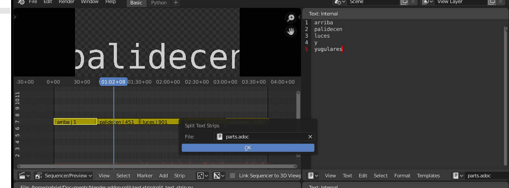

= Split a text strip from the lines of a text file

Adds a `Split Text Strip` operator that will become available on search when you have one VSE text strip selected.

To use, 

1. Create a text script in the VSE; calibrate its length.
2. Create a text file
3. On each line type the string for each of the text strip parts.
4. Call the operator → the strip will be split so that each line of the text becomes a new text strip.  The strip will be split in strips of equal length.

